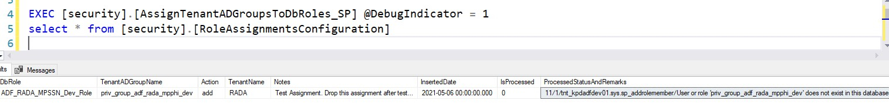

# kp-azure-a20tnt-synapse
This repository will house A20 tenant specific synapse resources. Please reach out to [Vamsee Lakkaraju](mailto:vamsee.lakkaraju@kp.org) or [Adbul H. Havaldar](mailto:abdul.h.havaldar@kp.org) for any issues related to version control and broken links in this documentation.

# Tenants Managed Data Access & Use folder 
Tenants Managed Data Access & Use folder contains 
1. code to deploy data access automated views and functions to apply Row & Column Level Security.
2. code to deploy select/view definition grants on views and schemas after views are created automatically
3. code to assign AD Group roles to database roles

## Deploy Tenants Managed Data Access & Use Solution On Tenants Synapse Instance

### Manual Deployment
1. Create a schema security on Tenant database
```T-SQL
    CREATE SCHEMA security;
```
2. Deploy all tables in [master branch](https://github.kp.org/CSG/kp-azure-a20tnt-synapse/tree/master/Tenants%20Managed%20Data%20Access%20%26%20Use/Tables) in any order.

3. Deploy all Stored Procedures in [master branch](https://github.kp.org/CSG/kp-azure-a20tnt-synapse/tree/master/Tenants%20Managed%20Data%20Access%20%26%20Use/Stored%20Procedures) in any order.

### Automated Deployment
Tenant can automate the DAU tenants (security solution) scripts deployment in two ways
1. Use the Jenkins pipeline (pl_deploy_security_soln_dacpac) and deploy dacpac to a tenant database.
2. Integrate the stages in Jenkinsfile in the tenant Jenkins pipeline and deploy security solution scripts to tenant database.

**NOTE**: This section covers #1 - provide steps to deploy security solution scripts on a tenant database but not to advise or provide steps for end-end deployment of Synapse & AzDF code deployments.

Make sure below configuration (parameters in pipeline) is available to use Jenkins pipeline (pl_deploy_security_soln_dacpac) to deploy the security solution

1. **Server Name**: Name of the tenant sql server
2. **Database Name**: Name of the tenant sql database
3. **Authentication Type**: Choose an Authentication Type to deploy dacpac file
* Choose Authentication Type as AAD Service Principal to use Application Registration or Service Principal identities on Azure to deploy dacpac file
* Choose Authentication Type as AD Service Account to use domain accounts to deploy dacpac file
* Choose Authentication Type as SQL Account to use local sql accounts to deploy dacpac file 
3. **User Name**: SQL Account with DBO or Control permissions on tenant sql database
4. **Password**: Password of the sql account
5. **Git Repo URL**: Use [kp-azure-a20tnt-synapse](https://github.kp.org/CSG/kp-azure-a20tnt-synapse) link as the GitRepoUrl parameter value
6. **Branch Name**: Tenant has to figure out release version of security solution is deployed on Tenant database based on past deployments. Example: If tenant deployed V1.0 release in the past, then tenant should deploy next version - V2.0.

**NOTE**: Tenant must not skip releases for deployment.  Consecutive releases are forward compatible. 

Steps to deploy the security solution on tenant database
1. Go to Jenkins pipeline - [pl_deploy_security_soln_dacpac](https://jenkins-bluemix.kp.org/job/MSFT/job/DAU/job/pl_deploy_security_soln_dacpac/).

2. Click on Build with parameters in the left navigation pane,  provide the required configuration and click on Build button.

3. Check the deployment status by checking the stage view.
. Upon deployment verify deployment by clicking on [deployment output link]( https://jenkins-bluemix.kp.org/job/MSFT/job/DAU/job/pl_deploy_security_soln_dacpac/lastBuild/console).


## Capabilities Of Tenants Managed Data Access & Use Solution
### Generate and Deploy Views with Grants
1. Tenants can choose to automatically deploy views or generate view scripts to manually deploy based on tenant deployment maturity model. This solution deploys/generates view without RLS and CLS applied if no RLS and CLS configurations are provided on a table.

    * When tenants execute the deployment scripts, tenants can configure different parameters to execute the automated solution. Please read the comments for each parameter.

     ``` T-SQL
     DECLARE @BatchId BIGINT
    EXEC [security].[OrchestrateRlsAndCls_SP]
            -- Provide this parameter when executing 
            -- the SP for the first time end to end
            @DeploymentStartDatetimeInUTC = ''
            /* 
                Provide the list of tables (fully qualified table name<schema.table>) separated by a delimiter ';'. 
                If @TableList parameter is provided, views are refreshed/created only for tables include in
                @TableList
            */
            , @TableList = ''
            /*
                If tenants choose to deploy the views, set the value to 1
                If tenants choose to generate the view, set the value to 0
                The scripts are persisted in security.GeneratedObjectScripts table
            */
            , @DeploymentIndicator = 1
            /* 
                
            */
            , @DebugIndicator = 1
            /*
                If tenants choose to generate the report for auditing or
                monitoring set the @GenerateReportIndicator to 1 else 0
            */
            , @GenerateReportIndicator = 1
             /*
                If tenants choose to deploy grants on view or schema using this
                solution set the @DeployGrantsIndicator = 1 else 0
            */
            , @DeployGrantsIndicator = 1
            , @DeploymentBatchID = @BatchId OUTPUT

    /*
        For every deployment, a batch Id is generated (yyyymmddhhmmss format) to track the deployment. 
        Security.log table contains all the steps and errors during execution and queried on.
    */
    SELECT * FROM security.log WHERE BatchId = @BatchId ORDER BY INSERTEDDATE
    SELECT * FROM [security].[GeneratedObjectScripts] WHERE BatchId = @BatchId
    ``` 
### Configure Row Level Security Metadata
2. To configure RLS, use **security.RLSConfiguration, security.FilterConfiguration** tables.
    
    | RlsId | SchemaName | TableName | RowFilterColumnName | FilterType | IsEnabled | InsertedBy | InsertedDate | UpdatedBy | UpdatedDate |
    |-----|-----|-----|----|-----|----|-----|------|------------|----------|
    |1|WRKGRPDT_T|ODS_MBR|RGN_CD|dau.region|1|I171705@kp.org|5/7/2021|I171705@kp.org|5/7/2021|

    * In above example, provide the column name on which RLS should be applied for a table in a schema. 

    * Once RLS configuration for a column is added to **security.RLSConfiguration** table, then provide the AD Groups or database roles who can see data based on Row level filters. The table **security.FilterConfiguration** holds the AD group or database role associated to filter row level data. **NOTE: USE DATABASE ROLES ONLY for ADGroupOrRoleName column**

    | SecurityType | FilterType | ADGroupOrRoleName | FilterValue |
    |-----|-----|-----|----|
    |Row|dau.region|RADA_MPPHI_CN|CN|
    |Row|dau.region|RADA_MPPHI_HI|HI|
    |Row|dau.region|RADA_MPPHI_HA|HA|

    * If the above configuration is applied, then WRKGRPDP_V.ODS_MBR view is deployed on database. Users can access data by using below query.
    ``` T-SQL
    SELECT * FROM WRKGRPDP_V.ODS_MBR
    ``` 
    If a user is added to AD group **RADA_MPPHI_CN**, user gets access to region CN. All other users who are not added to **RADA_MPPHI_CN** can not access CN region data. Similarly, users in _HI and _HA groups would get access to respective locations.
### Configure Column Level Security Metadata (Including Nesting)
3. To configure CLS, use **security.CLSConfiguration, security.FilterConfiguration** tables.
    
    | ClsId | SchemaName | TableName | ColumnName | FilterColumnName | FilterType | IsEnabled | InsertedBy | InsertedDate | UpdatedBy | UpdatedDate |
    |-----|-----|-----|----|-----|----|-----|------|----|-------|----------|
    |1|WRKGRPDT_T|ODS_MBR|BIRTH_DT|RGN_CD|dau.meberpatienphi|1|I171705@kp.org|5/7/2021|I171705@kp.org|5/7/2021|

    * In above example, provide the column name (FilterColumnName) on which CLS should be applied for a table in a schema. This will allow to secure data in a column based on another column. In above example, BIRTH_DT can be secured based on RGN_CD column data

    * Once CLS configuration for a column is added to **security.CLSConfiguration** table, then provide the AD Groups or database roles who can see data based on another column data. The table **security.FilterConfiguration** holds the AD group or database role associated to filter column level data. **NOTE: USE DATABASE ROLES ONLY for ADGroupOrRoleName column**

    | SecurityType | FilterType | ADGroupOrRoleName | FilterValue |
    |-----|-----|-----|----|
    |Column|dau.meberpatienphi|RADA_MPPHI_CN|CN|

    * If the above configuration is applied, then WRKGRPDP_V.ODS_MBR view is deployed on database. Users can access data by using below query.
    ``` T-SQL
    SELECT * FROM WRKGRPDP_V.ODS_MBR
    ``` 
    If a user is added to AD group **RADA_MPPHI_CN**, user gets access to region CN. All other users who are not added to **RADA_MPPHI_CN** can not access CN region data. 

4. The automated solution provide capabilities to skip the view creation by addiing schema and table name to **security.ViewsNotRequired** table. If the value of TableName column for a schema is *, then the views are not created for all tables in a schema. If both table and schema name are provided, then view is not create for second configuration in the table.

    | SchemaName | TableName |
    |--------|----------|
    |WRKGRPDT_T|*|
    |PUB_T|ODS_MBR|
### Grants and Permissions to Views
5. The automated solution provide configuration to apply grants on view or schema
    * This solution can apply SELECT or VIEW DEFINITION grants on a view or schema.
    * Connect GRANT is automatically applied when a user/AD Group is added to the database.
    * The grants configurations are managed in a table **security.AccessToSecuredViewsConfiguration**.

    | AccessId | SchemaName | TableName | GrantType | Grant | ADGroupOrRoleName |
    |--------|----------|---------|---------|------------------|----------|
    |1|WRKGRPDT_T|ODS_MBR|GRANT|SELECT|RADA_MPPHI_DEV|
    |2|PUB_T|NULL|GRANT|SELECT|RADA_MPSSN_DEV|

    * The configuration table contains the name of table and schema but the grants are applied on views that are generated in _V schema.
    * If the table name is null, then the grants are applied on a schema.
    * The grants are applied only if the views are deployed by the solution.
### Role Assignments to AD Groups
6. The automated solution allows to configure & apply grants for RLS and CLS to database roles or AD Groups. As per DAU, the RLS and CLS should applied on database roles and hence tenants need to way to assign AD Group(s) to a role(s). Following steps provide a way to configure database role assignments for AAD groups.

    * Role Assigned is managed in **security.RoleAssignmentsConfiguration** table.
    
    | RoleAssignmentId | DbRole | TenantAdGroupName | Action | Tenant | Notes | InsertedDate | IsProcessed | ProcessedStatusAndRemarks | RoleAssignmentDate |
    |-----|------|-----|-----|-----|-----|------|-------|-------|--------|
    |1|ADF_RADA_MPSSN_Dev_Role|priv_group_adf_rada_mpphi_dev|add|SELECT|Test Assignment|5/7/2021|NULL|NULL|NULL|
    
    * RoledAssignmentDate and InsertedDate are in UTC.
    * Two actions are supported **ADD** OR **DROP**. Add will assign AD group to a database role. DROP will remove AD group from a database role.

**NOTE:** Role Assignements are not meant to be executed as part of deployment. Role assignments should be executed frequently without any delay (inserting role assignments configuration to **security.RoleAssignmentsConfiguration** table) however tenant(s) can choose to execute role assignments at the time of code deployment also.

Tenant(s) can execute the role assignments in two ways to support manual & frequent/automated role level executions.

### Manual Role Assignment Execution

If tenant chooses to execute role assignments at the time of code deployment or manually, please execute the following script

The role assignment stored procedure will execute all role assignments where IsProcessed = NULL 

``` T-SQL
EXEC [security].[AssignTenantADGroupsToDbRoles_SP] 
-- Set Debug Indicator to 1 for debugging or troubleshooting purposes
@DebugIndicator = 1
```
After executing the role assignment stored procedure, the AD groups are either assigned to database roles with IsProcessed = 1 or the role assignment fails if the database role or AD group does not exist in the database.

In the below example, the role assignment failed because the AAD group did not exist in the database.



### Automated Role Assignment Execution

The automated role assignment(s) execution can be implemented in many ways. The recommended way by MSFT and Architecture team is to use AzDF pipeline and schedule the stored procedure execution every 15 minutes.

This AzDF pipeline must reside in tenant AzDF instance to execute the role assignments.

Tenant(s) must make sure to setup following pre-requisties for successful role assignment(s) execution.

1. The service account used by tenant AzDF pipeline must have execute permissions on the stored procedure - [security].[AssignTenantADGroupsToDbRoles_SP]
2. The service account used by tenant AzDF pipeline must have one of the following permissions and based on role assignment configuration(s)
	
* Membership in the db_securityadmin or db_owner fixed database role.
* Membership in the role that owns the role.
* ALTER ANY ROLE permission or ALTER permission on the role.
* Adding members to fixed database roles requires membership in the db_owner fixed database role.

Please create an AzDF pipeline and configure Stored Procedure activity with
**[security].[AssignTenantADGroupsToDbRoles_SP]** stored procedure using [this](https://ajitpatra.com/2018/11/23/azure-execute-stored-procedure-using-azure-data-factory/) reference implementation. Please note the linked service will be Azure SQL Data Warehouse type.

## Considerations To Apply RLS & CLS
1. Tenants does not have access to data/tables. Tenant users always access data via Views. Exception:  If tenants choose to not create views on a table, only then tenant users will have access to table(s).
2. Column Level Security is managed using CASE statements in a view and Row Level security is applied using filter predicate functions cross applied on a view.
3. Column or Row Level Security does not change tenant’s queries structure or query patterns. The view and the underlying table columns, column(s) name and metadata of columns are same. Example: If the requirement is to protect a column (lets say MemberSSN) on a table with 6 columns, users will have access to all columns and MemberSSN column data is masked.  
4. Table and view are same. Tables are hosted in _T schema and views are hosted in _V schema. Please note that views can be created for a table or view hosted in _T schema only.
5. RLS is applied on a table by creating a filter predicate funtion which evaluates if tenant user has access to the row. RLS is usually applied by creating security policy on a table/column and apply filter predicate. In Azure SQL Data Warehouse (Gen2 - Synapse), a table can have one security filter. Security policies will interfer with nested RLS requirements. Due to these limitations, the solution does not offer RLS with security policies, there by tenant DBA's must audit the RLS functions using DDL audit capabilities.
6. Filter predicates are applied using a function on SELECT/INSERT/UPDATE/DELETE operations on a table. A filter predicate is created for per column/table combination. Filter predicates should be audited using DDL tracking auditing.
7. CLS is not applied using CLS (hide columns - this changes the query structure), CLE (encrypt column data - this changes the way data is queried), AE (not supported) or DDM (not secure when default or custom functions are used) in-built features. CLS is applied using case expressions with ISMEMEBER capability. 
8. Nested CLS capability is not supported by Azure SQL Data Warehouse (Gen2 - Synapse).


